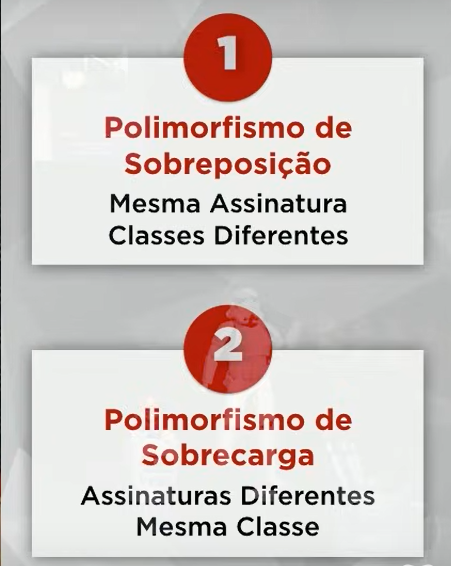

# Anotações do Curso de Java Orientado a Objetos

## O que é Programação Orientada a Objetos

* Alan Kay - Criador
* Funcionario da Xerox
* Criou a linguagem de programação Smalltalk para ser usada em um prototipo da empresa
* Smalltalk, primeira linguagem orientada a objetos

O objetivo da programação orientada a objetos é mudar o foco na hora de programar, pensar menos em detalhes (ciruitos, peças específicas, etc) e mais no objeto a ser programado. Desta forma, simplificando o ato de programar.

A maioria das principais linguagens de programação mais utilizadas atualmente são orientadas a objetos ou, pelo menos, utilizam os seus conceitos.

Vantagens:

* Confiável - O isolamento das partes gera um software seguro, por não afetar o conjunto completo no caso de modificações
* Oportuno - Possivel desenvolver as varias partes do software em paralelo
* Manutenível - Atualização mais fácil e que beneficia o todo
* Extensível - Software não estático, podendo adicionar mais funcionalidades
* Reutilizável - Poder reutilizar objetos de outros sistemas
* Natural - Mais fácil de entender e se preocupa mais com a funcionalidade do que com os detalhes da implementação

## Objetos

Um objeto pode ser uma coisa material ou abstrata que pode ser descrita por suas características, comportamento e estado.

Em outras palavras todo objeto tem: atributos, métodos(funções e procedimentos) e estado(caracteristicas atuais que podem ser identificadas através dos atributos).

O estado de uma classe/objeto é definido em um momento específico.

* __Classe__ : pode ser considerado um molde para criar um objeto. Exemplo:

```
public class Caneta {

    String modelo;
    String cor;
    float ponta;
    int carga;
    boolean tampada;

    void rabiscar(){
        if(this.tampada){
            System.out.println("ERRO! Não posso Rabiscar");
        }else{
            System.out.println("Estou rabiscando");
        }
    }
}
```

* __Instanciar__ : gerar um objeto a partir de uma classe. Exemplo:

```
Caneta c1 = new Caneta();
c1.cor = "Azul";
c1.ponta = 0.5f;
c1.tampada = "falso";
c1.rabiscar(); // esse é um método pois tem parenteses

```
   * É possível criar vários objetos com atributos diferentes usando a mesma classe.

Definição bibliografica: 

**Classe** define os atributos e métodos comuns que serão compartilhados por um objeto.

**Objeto** é uma instância de uma classe.

## Visibilidade de um Objeto

A visibilidade indica o nível de acesso aos componentes de uma classe. Existem 3

* Público (+) - O objeto *public* pode ser usado por qualquer um onde ele esteja disponível. Todas as classes tem acesso.
* Privado (-) - O objeto *private* somente uma "pessoa" tem acesso a esse objeto. Somente a classe atual tem acesso.
* Protegido (#) - O objeto *protected* somente quem tem a permissão pode usar. A Somente a classe atual e suas subclasses tem acesso.

Exemplo:

```
public class Caneta {

    public String modelo;
    public String cor;
    private float ponta;
    protected int carga;
    private boolean tampada;

    public void rabiscar(){
        if(this.tampada){
            System.out.println("ERRO! Não posso Rabiscar");
        }else{
            System.out.println("Estou rabiscando");
        }
    }

}
```

**OBS**: Toda linguagem de programação define uma visibilidade padrão para os objetos, que podem ser modificadas declarando-as como no exemplo

**OBS 2**: Procurar sobre UML e Diagrama de Classes

## Métodos Especiais

Métodos em geral podem ser criados seguindo a lógica conveniente ou usando o nome que o dev achar mais adequado. No entanto existem alguns métodos com funções específicas em que, por convenção, se usa padrões para criá-los e nomeá-los. 

### Método Acessor (Getter)

Por segurança definimos um nível de acesso private ou protected para algum atributo de uma classe, porém a informação desse atributo pode ser necessária. É nesses casos, onde o usamos os métodos getter.

### Métodos Modificadores (Setter)

São métodos modificam o status de um atributo da classe. Pelos mesmos motivos do método acessor é necessário restringir o acesso direto ao atributo, mas é possível modificar usando esses métodos. Normalmente, são métodos que exigem um parâmetro do usuário para serem executados e esses parâmetros serão tratados dentro do método para, ai sim, modificar o atributo.

Exemplo de criação:

```
public class Caneta {
    private String modelo;
    private float ponta;

    public String getModelo(){
        return this.modelo;
    }

    public void setModelo(String m){
        this.modelo = m;
    }

    public float getPonta(){
        return this.ponta;
    }

    public void setPonta(float p){
        this.ponta = p;
    }
}
```

Exemplo de uso:

```
Caneta c1 = new Caneta();
c1.setModelo("Bic Cristal");
c1.setPonta(0.5);
System.out.print(c1.getModelo());
System.out.print(c1.getPonta());
```

### Método Construtor (Construct)

Método que irá ser chamado para executar automaticamente algum procedimento ou modificação sem a interferência direta do usuário. Esses métodos são chamados assim que o objeto é criado e podem receber parâmetros ou não.

Exemplos:

```
public Caneta(){
        this.tampada();
        this.cor = "Azul";
    } // Metodo construtor sem parametros

Caneta c1 = new Caneta();
```

```
public Caneta(String m, String c, float p){
        this.modelo = m;
        this.cor = c;
        this.ponta = p;
    } //metodo construtor com parametros

Caneta c1 = new Caneta("BIC","Azul",0.5f);
```

_**OBS**_: No Java não precisa colocar o tipo de retorno no método construtor e o nome do método tem que ser o mesmo nome da classe.

_**OBS 2**_: Em algumas IDEs é possível gerar os métodos getter, setter e constructor automaticamente. Exemplo: **IntelliJ alt+insert**

_**OBS 3**_: É uma boa prática usar os metodos get e set até mesmo dentro da classe original.

## Encapsulamento

Conceito de encapsulamento: Ocultar partes independentes da implementação, permitindo construir partes invisíveis ao mundo exterior.

Um software encapsulado segue padrões que irá proteger o usuario(dev) do código, evitando que um codigo "estrague" o trabalho do dev e que o dev "estrague" o codigo encapsulado. resumidamente é um envolucro que protege um código e padroniza ao mesmo tempo.

Um objeto encapsulado ele trabalha através de mensagens que irá receber e enviar informações para o usuario. Para o usuario saber o que aquele objeto faz será utilizado as interfaces que estabelecem esses limites do que aquele objeto é capaz de fazer.

Conceito de interface: Lista de serviços fornecidas por um componente. É o contato externo, que define o que pode ser feito com um objeto dessa classe.

_**OBS**_: Encapsular não é obrigatório, mas é uma boa prática de POO.

Vantagens:

* Tornar mudanças invisíveis
* Facilitar reutilizar código
* Reduzir efeitos colaterais

As interfaces não possuem atributos, somente métodos. Esses são métodos abstratos, pois não executam ação dentro do método, apenas indica a ação que será realizada. Todos os métodos da interface são publicos.

Quando se realiza o encapsulamento, todos os atributos de uma classe serão privados. Na classe deve ser indicado que ela implementará os metodos da interface(esses métodos serão colocados dentro da classe). Além desses métodos, devem ser implentados os getters e setters, visto que os atributos estão privados.

A interface é implementada em um arquivo diferente da classe.

* No Java utilizamos o modificador `abstract` nos métodos criados dentro das interfaces
* Para implentar uma interface numa classe usamos o `implements`. Exemplo: `public class ControleRemoto implements Controlador`

## Relacionamento entre classes

Além de atributos e métodos é possível com as classes criar relacionamentos entre elas.

### Relacionamento por agregação

Tipo abstrato de dados: transformar as classes em determinados tipos, criando, dessa forma, uma instancia de uma classe dentro de outra. Exemplo:

_Classe lutador instanciada dentro da classe Luta_

```
 public class Luta {
    private Lutador desafiado;
    private Lutador desafiante;
    private int rounds;
}
```

É possível usar tipos abstratos como parametros nos métodos.

Se usado um tipo abstrato de dados, também é possível utilizar no objeto desse tipo os métodos da classe instanciada. Exemplo: `desafiado.getCategoria();`

- Se existir um relacionamento entre as classes, deve ter um **papel**, um verbo que identifica essa relação. No caso das classes lutador e luta é o verbo **disputa**.
- Toda relação tem sua multiplicidade, que é o nivel de ocorrencia daquela relação. Exemplo: um lutador pode disputar **nenhuma ou várias lutas**, e uma luta pode ser disputada por **vários** lutadores.

**OBS:** O relacionamento dentro Diagrama de Classes é uma evolução do Diagrama de Entidade-Relacionamento(DER), por isto as semelhanças. No entanto, no Diagrama de Classes possui dados(atributos) e métodos, dirente do DER que só possui dados.

Um relacionamento por agregação é do tipo _tem um_. Determinada classe A tem um atributo que pertence a classe B, ou é uma instancia, criando assim o relacionamento com a outra classe.

## Herança

Conceito: Permite basear uma nova classe na definição de outra classe previamente existente. A herança é aplicada tanto para as características(atributos), quanto para os comportamentos(métodos)

Com a herança é possível criar uma classe sem precisar escrever tudo do zero, herdando elementos de outra classe.

* Classe Mãe(superclasse): quem passa as suas características e métodos.
* Classe Filha(subclasse): quem herda as características e métodos da classe mãe. Nesse caso, não necessita declarar novamente os métodos e atributos da superclasse, pois automaticamente serão associados a subclasse.

**OBS**: O conceito de superclasse e subclasse depende do ponto de vista. Um classe mãe também pode ser uma classe filha de outra. Um classe que não tem uma classe mãe é chamada de raiz. Já as subclasses que não dão origem a outras classes são chamadas de folhas.

* Classe ancestral: que ligação indireta com outra classe, sem considerar a classe mãe.
* Classe descendente: recebe herança indeireta de outra classe, sem ser sua subclasse.

### Herança de implementação

É uma herança pobre, pois não implementa mais nenhum método ou atributo, somente herda da superclasse. Utilizada para implementar uma classe abstrata.

### Herança para diferença

É uma herança forte, pois a subclasse que herda os métodos e atributos, também vai implementar os seus próprios.

### Abstrato e Final

As classes e métodos podem ser abstratas ou finais. Conceito:

* Classe abstrata: não pode ser instanciada. Só pode servir como progenitora(superclasse).
* Método abstrato: que é declarado, mas não implementado na progenitora. Só pode ser colocado dentro de uma interface ou classe abstrata.
* Classe final: Não pode ser herdada por outra classe. Obrigatoriamente folha.
* Método final: Não pode ser sobrescrito pelas subclasses. Obrigatoriamente herdado.

## Polimorfismo

**Polimorfo**: Muitas formas - Permite que um mesmo nome represente vários comportamentos diferentes.

* Assinatura do método: Quantidade e os tipos dos parâmetros do método. Métodos com essas caracterísitcas iguais tem a mesma assinatura.

### Polimorfismo de Sobreposição

Conceito: acontece quando substituímos um método de uma super classe na sua subclasse, usando a mesma assinatura.

- Nesse casso, no Java usamos o `@Override` para sobrescrever o método já proposto na classe mãe e alteramos o comportamento dele.
- A sobreposição acontece somente uma vez para o método dentro da classe e para realiza-la é obrigatório manter a mesma assinatura do método. 

### Polimorfismo de Sobrecarga

No Polimorfismo de Sobrecarga utilizamos vários métodos com o mesmo nome, porém com assinaturas diferentes (diferindo em número, tipo ou ordem dos parâmetros). Eles devem estar dentro da mesma classe. Esse tipo de polimorfismo permite usar diferentes soluções para uma mesma ação, de acordo com o contexto em que o método é utilizado, ou seja a assinatura.


**RESUMO**



## Extras - informação adicional sobre POO no Java

### Classe Object e toString()

Todas as classes do Java são subclasses da classe Object e herdam os seguintes métodos:

* getClass: retorna o tipo de objeto
* equals: compara se dois objetos são iguais
* hashCode: retorna o código hash do objeto
* toString: converte o objeto para String

O método toString pode ser sobrescrito na classe criada para apresentar o conteudo necessário. Dentro de metodos de saida como `System.out.print()` se usarmos como parametro um objeto instanciado sem explicitar o método, automaticamente o Java chama o método toString. 

---

### Membros estáticos

São atributos ou métodos declarados com o modificador `static` e que não precisão ser instanciados dentro de um objeto para serem chamados, e são chamado na aplicação a partir do nome da classe. Por este motivo são também chamados de membros de classe.

Sao utilizadas normalmente em classes utilitarias, como a **classe Math**, e na declaração de constantes.

Uma classe também pode receber o modificador `static`, porém esse tipo de classe não pode ser instanciada.

**OBS:** Não é possível chamar um método que não possui o modificador estático dentro de um método estático, quando estão na mesma classe.

Um método ou atributo pode receber o modificador `static` para os casos que o seu resultado independe de um objeto especifico, como é no caso de constantes e calculos matemáticos.

### Tipos de Referência x Tipos de Valor

**Variáveis de tipo referência:** são variáveis em que seu tipos são classes. Essas váriaveis não armazenam valores, mas sim um endereço de memória, que aponta para um local na memoria chamado *heap* que armazena as informações. Exemplo: Classe String.

Principais características:

- Usufrui recursos do POO
- Objetos precisam ser instanciados ou apontar para um objeto existente
- Aceita valor nulo
- Objetos não sao desalocados pelo garbage colector

**Váriaveis de tipo valor:** são variáveis de tipos primitivos. Elas são "caixas" que realmente armazenam valores no campo de memória chamado stack. Exemplo: int, char, double, boolean.

Principais características: 

- São mais simples e performáticas
- Não precisam ser instanciadas, assim que declaradas podem ser usadas
- Não aceita valor nulo
- Variáveis são desalocadas imediatamente assim que o escopo é finalizado.

**Valores Padrão:** Quando instanciamos uma classe ou array seu atributos recebem valores padrão que podem ser
- números(int, double, etc): 0
- boolean: false
- char: caractere 0
- objeto(String ou outra classe): null

### Desalocação de Memória

**Garbage colector:** Processo que gerencia o uso da memória. Ele monitora o uso do heap e desaloca objetos que não possuem mais referência, ou seja, não possui mais variáveis do tipo rerencia apontando para seu endereço.

**Desalocação por escopo:** Processo que elimina as variáveis do tipo valor após o fim do escopo. Exemplo, váriavel declarada dentro de um if e que será eliminada após o fim do if.

### Vetores

É uma estrutura de dados do mesmo tipo, ordenada e alocada de uma só vez em um bloco sequencial de memória, ou seja, possuem tamanho fixo. Com vetores é possível ter acesso imediato aos elementos de acordo com sua posição, entreanto, é mais difícil realizar modificações entre as posições do vetor.

**OBS:** Quando criamos um vetor de tipo referência cada posição vai armazenar um ponteiro para o objeto na memoria heap. Sendo assim, quando vamos definir o valor daquela posição do vetor é necessário instanciar para criar o objeto.

### Boxing, Unboxing e Wrapper Classes

**Boxing:** Processo de conversão de um objeto do tipo valor(primitivo) para um tipo de referência compatível. Exemplo:

```
int x = 20;
Object obj = x;
```

**Unboxing:** Processo de conversão de um objeto de tipo referência para um objeto de tipo valor. Exemplo:

```
int x = 20;
Object obj = x;
int y = (int) obj;
```

**Wrapper Classes:** São classes equivalente aos tipos primitivos, e que permitem utilizar os benefícios da Orientação a Objetos. É normalmente usada em sistemas de informação, para compatibilizar o programa com os bancos de dados, visto que muitos campos dos BD aceitam valores nulos.

As wrapper classes do Java são: Boolean, Character, Byte, Short, Integer, Long, Float e Double.

**OBS**: As wrapper classes tem o mesmo nome dos tipos primitivos, mas para diferenciá-las, elas começam com a letra maiúscula.

### Listas

É uma estrutura de dados homogênea(os dados tem que ser do mesmo tipo), ordenada, que inicia vazia e os dados são alocados dinamicamente dependendo da necessidade. Quando alocamos um elemento na lista, dizemos que ele ocupa um nó. No Java as listas são uma interface do tipo List. Essa interface possui implementação nas classes ArrayList, LinkedList, etc.

Vantagens:
* Tamanho variável
* Facilidade para inserir ou deletar informações

Desvantagens:
* Acesso sequencial - para acessar um elemento é necessário percorrer a lista até ele. Obs: dependendo da implementação da interface o acesso pode ser facilitado.

No java as listas não aceitam tipos primitivos, então é necessário usar as wrapper classes para definir o tipo de dados e para instanciar é necessário usar a classe que implementa a interface List. Exemplo: `List <String> list = new ArrayList<>();`

### Matrizes

É um arranjo biddimensional, de dados homogêneos e ordenada. Pode ser entendido como um vetor com linhas e colunas. Assim como os vetores, as matrizes também são alocados em um bloco continuo de memória. Possui as mesmas vantagens e desvantagens de um vetor.